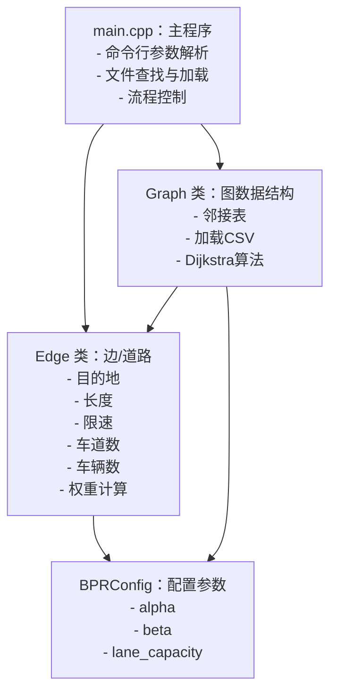

# 数据结构 Project 中期文档

## 〇、运行示例

```
PS D:\Jimmy\_data_structure\PJ> .\pathfinder.exe --test_path D:\Jimmy\_data_structure\PJ\Test_Cases\test_cases\shanghai_test_cases\case1_simple\
Request: Find path from "上海世纪公园" to "复旦大学（邯郸校区）".

========================================================
Processing map: D:\Jimmy\_data_structure\PJ\Test_Cases\test_cases\shanghai_test_cases\case1_simple\map_1200.csv   
========================================================
Path found! Total estimated time: 496.8 seconds.
The shortest path is:
上海世纪公园 --> 五角场 --> 复旦大学（邯郸校区）
```

```
PS D:\Jimmy\_data_structure\PJ> .\pathfinder.exe --test_path D:\Jimmy\_data_structure\PJ\Test_Cases\test_cases\shanghai_test_cases\case2_medium
Request: Find path from "上海科技馆" to "上海博物馆".

========================================================
Processing map: D:\Jimmy\_data_structure\PJ\Test_Cases\test_cases\shanghai_test_cases\case2_medium\map_0800.csv
========================================================
Error: Start node '上海科技馆' not found in graph.
No path found.


========================================================
Processing map: D:\Jimmy\_data_structure\PJ\Test_Cases\test_cases\shanghai_test_cases\case2_medium\map_1400.csv
========================================================
No path found.
```


## 一、最短路径算法总结

### 1. Dijkstra 算法
**核心思想**：贪心策略，每次选择当前距离起点最近的未访问节点进行扩展，通过松弛操作逐步确定所有节点的最短路径。

**适用场景**：
- 单源最短路径问题
- 边权重为非负数的图
- 静态图

**时间复杂度**：
- 使用优先队列（二叉堆）：O((V + E) log V)
- 使用斐波那契堆：O(E + V log V)

**空间复杂度**：O(V)，需要存储距离数组、前驱数组和优先队列


### 2. A* 算法

**核心思想**：启发式搜索，在 Dijkstra 基础上引入启发函数 h(n)，优先扩展 f(n) = g(n) + h(n) 最小的节点。

**适用场景**：
- 单源单目标最短路径
- 有明确目标点的场景（如游戏、地图导航）
- 启发函数设计良好时效率高

**时间复杂度**：O(E)（最优情况），O(b^d)（最坏情况，b 为分支因子，d 为深度）

**空间复杂度**：O(V)


### 3. BFS（广度优先搜索）
**核心思想**：按层次遍历。

**适用场景**：
- 无权图的最短路径
- 所有边权重相等的图

**时间复杂度**：O(V + E)

**空间复杂度**：O(V)


## 二、Dijkstra 算法最优性分析

在理想的静态路径规划中，边权重非负，Dijkstra 算法总能保证找到最优路径。

### 最优性证明

起点到自身的最短距离为 0，显然是最优的。

假设算法在第 k 步时，已经确定的 k 个节点的最短路径都是最优的。在第 k+1 步，算法选择距离起点最近的未访问节点 u（设其距离为 d[u]）。

假设存在一条从起点到 u 的更短路径 P，其长度为 d' < d[u]。路径 P 必然经过某个已访问节点到未访问节点的边界。设这个边界点为 x（已访问）→ y（未访问）。由于边权非负，从起点到 y 的距离 ≥ 从起点到 x 的距离。又因为 x 已被访问，说明 d[x] ≤ d[u]，因此 d[y] ≥ d[x] ≥ d[u]，这与假设的 d' < d[u] 矛盾。

因此，Dijkstra 算法每次确定的最短路径都是最优的。


## 三、稀疏图与稠密图的表示选择

稀疏图适合用邻接表表示，稠密图适合用邻接矩阵表示。

在本次 project 中，邻接表是更合适的选择。首先，城市道路网是典型的稀疏图。其次，Dijkstra 算法在稀疏图上效率更高。而且节点名称是字符串，使用 `unordered_map<string, ...>` 可以直接用地名索引，而邻接矩阵需要额外维护字符串到索引的映射。


## 四、Dijkstra 算法的路径回溯机制

### 路径回溯的原理

Dijkstra 算法在计算最短距离的同时，需要记录**路径信息**，以便在算法结束后还原完整路径。

#### 数据结构

```cpp
// 存储从起点到每个节点的最短距离
std::unordered_map<std::string, double> distances;

// 存储最短路径树中每个节点的前驱节点
std::unordered_map<std::string, std::string> predecessors;
```


#### 回溯步骤

##### 1. 前向计算阶段（Dijkstra 主循环）

在松弛操作中记录前驱节点。每当找到更短路径时，更新 `predecessors[neighbor] = current_node`，表示"到达 `neighbor` 的最短路径的上一跳是 `current_node`"。

```cpp
for (const Edge &edge : adj_list.at(current_node)) {
    std::string neighbor = edge.destination;
    double new_dist = current_dist + edge.weight;

    if (new_dist < distances[neighbor]) {
        distances[neighbor] = new_dist;
        predecessors[neighbor] = current_node;  // 记录前驱
        pq.push({new_dist, neighbor});
    }
}
```


##### 2. 后向回溯阶段

从终点开始，沿着 `predecessors` 逆向追溯到起点。

```cpp
std::vector<std::string> path;
std::string current = end;

while (predecessors.count(current)) {
    path.push_back(current);
    current = predecessors[current];  // 跳到前驱节点
}

path.push_back(start);  // 最后加入起点
std::reverse(path.begin(), path.end());  // 翻转得到正向路径
```


### **可视化路径的方法**

#### 方法 1：文本输出（当前实现）
```
A --> B --> C --> D
```


#### 方法 2：图形化可视化
可以使用一些python的库来绘图，例如matplotlib。


## 五、系统改进讨论

当前系统的局限性包括但不限于：

### 1. 缺乏实时性
目前系统读取静态 CSV 文件，模拟不同时间点的路况，这导致无法处理突发事件（例如事故、施工、交通管制等）。为此，可以考虑接入实时交通数据 API，并实现增量式路径更新。


### 2. 拥堵模型过于简化

目前的 BPR 函数只考虑当前道路的车辆数，未考虑上下游道路。可以考虑使用机器学习预测路况。步骤如下：

- 收集历史数据（时间、星期、天气、节假日 → 车流量）

- 训练 LSTM/GRU 模型预测未来路况
- 将预测值集成到权重计算中


### 3. 算法效率有待提升

标准 Dijkstra 算法对于大规模图的效率较低，可以考虑使用A*算法和双向Dijkstra算法进行优化。


### 4. 缺少多路径规划

现在只能输出一条最优路径（时间最短）。可以考虑按照距离优先、时间优先、综合推荐（综合距离、时间等因素）等维度搜索最短路径，然后将重复的去掉，最终输出结果。


### 5. 缺少路径缓存机制

目前每次查询都需要重新计算。可以使用LRU 缓存存储最近 N 次查询的结果。以后查询时，如果起点和终点相同，就直接返回缓存结果。此外，路况更新后需要清空缓存。


## 六、项目架构介绍

### 6.1 整体架构设计

本项目采用**模块化、面向对象**的设计思想，将系统划分为以下核心模块：



### 6.2 模块详细设计

#### Edge 类（边/道路）

表示图中的一条边（道路），封装道路属性和权重计算逻辑。

```cpp
std::string destination;   // 目标节点
double length;             // 道路长度（米）
double speed_limit;        // 限速（km/h）
int lanes;                 // 车道数
int current_vehicles;      // 当前车辆数
double weight;             // 边的权重（通行时间，秒）

// 使用 BPR 函数计算权重
// T = T₀ × [1 + α × (V/C)^β]
double calculate_weight() const;
```


#### Graph 类（图）

管理整个路网图，提供加载数据和路径查找功能。

```cpp
std::unordered_map<std::string, std::vector<Edge>> adj_list;
// 邻接表：节点名 → 出边列表
```

**核心方法**：

1. `bool from_csv(const std::string &filename)`
   - 从 CSV 文件加载地图数据
   - 动态解析表头，兼容不同列顺序（有些.csv没有“道路类型”这一项）
   - 异常处理：无效数据跳过并警告
   - 支持双向道路自动添加反向边

2. `std::vector<std::string> find_shortest_path(const std::string &start, const std::string &end)`
   - 实现 Dijkstra 算法
   - 使用优先队列优化
   - 返回路径节点列表


#### BPRConfig 类（配置）

集中管理 BPR 函数的全局参数，便于调整。

```C++
double BPRConfig::alpha = 0.15;				// 拥堵敏感系数，默认 0.15
double BPRConfig::beta = 4.0;				// 拥堵指数，默认 4.0
double BPRConfig::lane_capacity = 1800.0;	// 每车道容量，默认 1800 辆/小时
```


#### main.cpp（主程序）

**职责**：命令行交互、文件管理、流程控制。

**核心函数**：

1. `trim(const std::string &str)`：去除字符串首尾空白

2. `find_test_files(...)`：扫描目录，查找 demand 文件和 map 文件

3. `read_demand(...)`：解析 demand.txt，提取起点和终点

4. `print_path(...)`：格式化输出路径

5. `process_map(...)`：处理单个地图文件，调用 Dijkstra 并输出结果

6. `main(...)`：主流程控制


### 6.3 可能遇到的困难与挑战

#### 挑战 1：中文编码问题
Windows 终端默认 GBK 编码，UTF-8 文件读取会乱码。因此，在程序开头设置控制台为 UTF-8（`chcp 65001`）


#### 挑战 2：CSV 数据鲁棒性

CSV 文件可能有格式错误、缺失数据等问题（虽然给的文件里没有，但是这些异常情况是需要考虑的）。

**解决方案**：
- 动态解析表头，不依赖固定列顺序

- Try-catch 捕获数值转换异常

- 处理 `\r` 字符

- 跳过无效行并警告

  

#### 挑战 3：节点名称匹配失败
节点名称可能有多余空格，导致查找失败。因此，实现 `trim()` 函数去除首尾空白，并在读取节点名后立即 trim。


#### 挑战 4：参数调优
BPR 函数的 α、β 参数如何选择最合理？目前使用经典推荐值（α=0.15, β=4），未来可用真实数据训练拟合。


## 七、项目进度总结与规划

### 7.1 当前完成情况

1. **核心数据结构设计**
   - [x] Edge 类设计与实现
   - [x] Graph 类设计与实现
   - [x] BPRConfig 配置类设计与实现

2. **算法实现**
   - [x] Dijkstra 最短路径算法
   - [x] BPR 拥堵系数计算
   - [x] 路径回溯机制

3. **文件处理**
   - [x] CSV 地图文件解析
   - [x] demand.txt 需求文件解析
   - [x] 动态表头解析
   - [x] 异常处理和鲁棒性

4. **功能模块**
   - [x] 多地图文件顺序处理
   - [x] 命令行参数解析
   - [x] UTF-8 编码支持
   - [x] 路径格式化输出

5. **代码质量**
   - [x] 模块化设计
   - [x] 函数职责单一化
   - [x] 详细注释
   - [x] 错误处理完善


### 7.2 后续规划

#### 阶段 1：测试与调试

- [ ] 测试所有提供的测试用例
- [ ] 验证输出格式是否符合要求
- [ ] 边界情况测试：
  - 空图
  - 不连通图
  - 起点终点相同
  - 单向路径
- [ ] 性能测试：大规模测试用例运行时间
- [ ] 修复发现的 Bug


#### 阶段 2：优化与扩展

**必须完成**：
- [ ] 代码性能优化
- [ ] 代码重构和清理

**可选扩展**：

- [ ] A* 算法实现
- [ ] 路径可视化
- [ ] 输出多条（不同维度上的）最优路径供用户选择
- [ ] 参数敏感性分析实验


#### 阶段 3：最终文档

- [ ] 代码结构说明
- [ ] 算法实现细节
- [ ] 测试结果表格
- [ ] 遇到的问题与解决方案


## 八、编译与运行说明

### 9.1 开发环境

- **操作系统**：Windows 11
- **编译器**：MinGW-w64 GCC 14.2.0 / g++ 
- **标准**：C++17
- **IDE/编辑器**：Visual Studio Code


### 9.2 编译命令

```bash
g++ -std=c++17 main.cpp Graph.cpp Edge.cpp config.cpp -o pathfinder.exe
```


### 9.3 运行示例

```bash
.\pathfinder.exe --test_path Test_Cases\test_cases\shanghai_test_cases\case1_simple
```


### 9.4 预期输出

```
Request: Find path from "上海科技馆" to "上海博物馆".

========================================================
Processing map: Test_Cases/test_cases/shanghai_test_cases/case1_simple/map_1200.csv
========================================================
Path found! Total estimated time: 1234.56 seconds.
The shortest path is:
上海科技馆 --> 世纪大道 --> 人民广场 --> 上海博物馆
```


## 九、总结

本次中期检查已完成项目的核心功能开发，包括：
- 完整的图数据结构（邻接表）
- Dijkstra 最短路径算法
- BPR 拥堵系数建模
- 健壮的 CSV 文件解析
- 清晰的模块化设计

后续工作主要集中在测试、调试和文档完善，时间规划合理，风险可控。

项目完成后将具备：
1. 正确的路径规划功能
2. 良好的代码质量和可维护性
3. 完整的开发文档

距离实际应用还需要改进：实时性、可视化、多路径规划、性能优化等，这些已在第五部分详细讨论。
