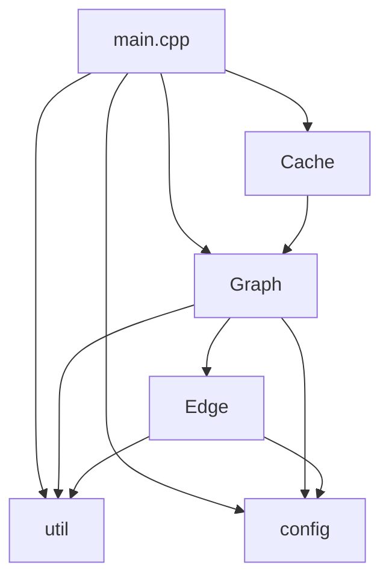

# 面向自动驾驶导航的路径规划系统 - 开发文档

**学号：24302010005**
**姓名：范骐鸣**

## 1 项目概述

本项目实现了一个面向自动驾驶导航的路径规划系统，能够在变化的交通条件下为用户提供最优路径。系统基于图论和Dijkstra算法，集成了BPR（Bureau of Public Roads）拥堵模型，能够实时计算道路的拥堵情况并规划出最优路径。本项目还实现了多路径规划，同时计算三种最优路径，分别是**时间最短路径、距离最短路径和综合推荐路径**，以最大程度地满足现实中用户的多样化需求。项目还实现了持久化LRU缓存机制，避免重复计算，显著提升性能。


## 2 代码结构概要

### 2.1 项目文件组织

```
PJ/
├── main.cpp              # 程序入口，命令行参数解析和主流程控制
├── Graph.h / Graph.cpp   # 图类实现，包含路径查找核心算法
├── Edge.h / Edge.cpp     # 边类实现，纯数据容器
├── Cache.h / Cache.cpp   # 持久化LRU缓存系统
├── config.h / config.cpp # 全局配置参数
├── util.h / util.cpp     # 工具函数（BPR计算、文件IO、输出格式化）
└── Test_Cases/           # 测试用例目录
    ├── test_cases/shanghai_test_cases/
    │   ├── case1_simple/
    │   ├── case2_medium/
    │   └── case3_complex/
    └── large_scale_cases/
```

### 2.2 核心数据结构

#### 2.2.1 PathResult（路径结果）

```cpp
struct PathResult {
    vector<string> path;      // 路径节点列表
    double time;              // 总时间（秒）
    double distance;          // 总距离（米）
};
```

无论使用哪种权重模式进行路径查找，PathResult总是包含完整的时间和距离两个指标，方便用户全面对比不同路径的优劣。

#### 2.2.2 MultiPath（多路径结果）

```cpp
struct MultiPath {
    PathResult time_path;      // 时间最短路径
    PathResult distance_path;  // 距离最短路径
    PathResult balanced_path;  // 综合推荐路径
};
```

#### 2.2.3 Graph（图类）

```cpp
class Graph {
private:
    // 邻接表：节点名 -> 边列表
    unordered_map<string, vector<Edge>> adjacency_list;

    // 权重范围（用于归一化）
    struct WeightRange {
        double time_min, time_max;
        double distance_min, distance_max;
    } weight_range;

public:
    void from_csv(const string& csv_path);
    PathResult find_shortest_path(const string& start,
                                   const string& end,
                                   WeightMode mode);
    double calculate_path_cost(const vector<string>& path,
                                WeightMode mode);
};
```

- `from_csv()`：加载CSV文件，并进行数据预处理
- `find_shortest_path()`：Dijkstra算法实现，返回 `PathResult`
- `calculate_path_cost()`：计算给定路径的总代价

#### 2.2.4 Edge（边类）

```cpp
class Edge {
private:
    string destination;           // 目标节点
    double length;                // 长度（米）
    double speed_limit;           // 限速（km/h）
    int lanes;                    // 车道数
    int current_vehicles;         // 当前车辆数

    // 预计算字段
    double time;                  // 通行时间（秒）
    double balanced_score;        // 综合评分（用于综合推荐路径）

public:
    double get_weight(WeightMode mode) const;
};
```

`Edge` 类是一个纯数据容器，储存预计算的 `time` 和 `balanced_score`，运行时直接获取，避免重复计算。

#### 2.2.5 PathCache（缓存类）

```cpp
class PathCache {
private:
    struct CacheEntry {
        string start, end;
        FileSignature file_sig;
        string cache_file;
        time_t created_time;
    };

    list<size_t> lru_list;                    // LRU顺序
    unordered_map<size_t, CacheEntry> entries; // 缓存条目

public:
    optional<MultiPath> get(const string& start,
                             const string& end,
                             const string& csv_path);
    void put(const string& start,
             const string& end,
             const string& csv_path,
             const MultiPath& result);
    void clear();
};
```

缓存采用LRU淘汰策略，并使用文件签名（`FileSignature`）检测变化。缓存还实现了持久化存储，存储路径是 `.cache`。

### 2.3 模块依赖关系




## 3 核心功能设计与实现

### 3.1 图的表示与加载

#### 3.1.1 图的存储结构

本项目采用**邻接表**表示图。这是因为城市路网是典型的**稀疏图**（边数远小于V²），邻接表的空间复杂度为O(V+E)，远优于邻接矩阵的O(V²)。

```cpp
unordered_map<string, vector<Edge>> adjacency_list;
```

#### 3.1.2 CSV动态加载（三遍预计算）

```cpp
void Graph::from_csv(const string& csv_path) {
    // 第一遍：加载基本数据，计算time字段
    for (each row in CSV) {
        double free_flow_time = calculate_free_flow_time(...);
        double congestion_factor = calculate_bpr_congestion_factor(...);
        edge.time = free_flow_time * congestion_factor;
        adjacency_list[source].push_back(edge);
    }

    // 第二遍：计算权重范围（用于计算balanced_score时归一化）
    calculate_weight_range();

    // 第三遍：计算balanced_score
    for (each edge in graph) {
        double norm_time = (edge.time - time_min) / (time_max - time_min);
        double norm_dist = (edge.length - dist_min) / (dist_max - dist_min);
        edge.balanced_score = alpha * norm_time + (1-alpha) * norm_dist;
    }
}
```

三种最优路径对应的权重分别为 `time`，`length` 和 `balanced_score`。`time` 和 `balanced_score` 的计算在加载数据时就预先进行，使得路径查找效率更高。三遍扫描的总开销为 $O(3E) = O(E)$，在可接受的范围内。归一化的目的是消除不同量纲的影响。
### 3.2 BPR拥堵模型

BPR函数（美国联邦公路局函数）是由美国公路局（Bureau of Public Roads）于1964年提出的经典交通数学模型，其核心功能是通过量化交通流量与路段通行能力的比值，计算实际行驶时间。

#### 3.2.1 BPR公式

$$
T=T_0(1+\alpha (\frac{V}{C})^\beta)
$$

式中 $1+\alpha (\frac{V}{C})^\beta$ 即拥堵系数。参数说明如下：

- $T_0$：自由流通行时间（秒）= 道路长度 / 限速
- $V$：交通流量（veh/h）= 车辆数 / 通行时间（小时）
- $C$：道路容量（veh/h）= 车道数 × 1800（veh/h/lane）
- $\alpha=0.15$：拥堵敏感系数（BPR标准值）
- $\beta=4.0$：拥堵指数（BPR标准值）

#### 3.2.2 实现细节

```cpp
double calculate_bpr_congestion_factor(int current_vehicles,
                                        int lanes,
                                        double length_meters,
                                        double speed_limit_kmh) {
    // 计算道路容量
    double capacity = lanes * CacheConfig::lane_capacity; // 1800 veh/h/lane
    // 计算自由流通行时间
    double free_flow_time_hours = calculate_free_flow_time(...) / 3600.0;
    // 从current_vehicles转换为flow
    double flow = current_vehicles / free_flow_time_hours;
    // 计算V/C比
    double vc_ratio = flow / capacity;
    // 应用BPR公式
    double factor = 1.0 + alpha * pow(vc_ratio, beta);
    return factor;
}
```

### 3.3 Dijkstra算法实现

#### 3.3.1 算法伪代码

```
function dijkstra(start, end, mode):
    dist[start] = 0
    pq.push((0, start))

    while pq not empty:
        (current_dist, u) = pq.pop()

        if u == end:
            break  // 提前终止优化

        if current_dist > dist[u]:
            continue

        for each edge (u -> v):
            weight = edge.get_weight(mode)
            if dist[u] + weight < dist[v]:
                dist[v] = dist[u] + weight
                predecessor[v] = u
                pq.push((dist[v], v))

    // 回溯路径
    path = reconstruct_path(predecessor, start, end)

    // 计算完整指标
    time = calculate_path_cost(path, TIME)
    distance = calculate_path_cost(path, DISTANCE)

    return PathResult{path, time, distance}
```

#### 3.3.2 优化技巧与技术细节

1. 使用优先队列 `std::priority_queue<pair<double, string>>`，时间复杂度 $O((V+E)\log V)$

2. 到达目标节点时立即终止，无需遍历全图

3. 不从优先队列中删除过时节点，通过比较距离跳过

4. 三种权重模式
   - `WeightMode::TIME`：使用`edge.time`（BPR预计算）
   - `WeightMode::DISTANCE`：使用`edge.length`
   - `WeightMode::BALANCED`：使用`edge.balanced_score`

5. `find_shortest_path()` 返回的PathResult已包含time和distance，无需额外计算

### 3.4 综合推荐路径权重计算

#### 3.4.1 归一化方法

```cpp
void Graph::calculate_weight_range() {
    time_min = INF, time_max = -INF;
    distance_min = INF, distance_max = -INF;

    for (each edge in graph) {
        time_min = min(time_min, edge.time);
        time_max = max(time_max, edge.time);
        distance_min = min(distance_min, edge.length);
        distance_max = max(distance_max, edge.length);
    }
}
```

#### 3.4.2 加权平均

```cpp
double balanced_score = alpha * normalized_time + (1 - alpha) * normalized_distance;
```

其中：
- `alpha = 0.6`（时间权重）
- `1 - alpha = 0.4`（距离权重）

权重因子 `alpha` 的选择依据是，时间稍微重要一些（60%），因为用户通常更关心到达时间；但距离也有意义（40%），因为距离影响燃油消耗和里程。不过，针对用户偏好，权重因子的值可以在`config.cpp`中调整。
### 3.5 持久化LRU缓存系统

#### 3.5.1 LRU算法实现

```cpp
class PathCache {
private:
    list<size_t> lru_list;                    // 访问顺序
    unordered_map<size_t, CacheEntry> entries; // key -> entry
    unordered_map<size_t, list<size_t>::iterator> position; // key -> list位置
};
```

具体操作包括查询（get）、插入（put）、清空（clear）等。

#### 3.5.2 文件签名机制

缓存系统采用**修改时间+文件大小**的轻量化文件签名机制，来检测文件变化。

```cpp
struct FileSignature {
    string canonical_path;     // 规范化绝对路径
    time_t modification_time;  // 修改时间
    size_t file_size;          // 文件大小
};
```

**路径规范化：**

```cpp
canonical_path = std::filesystem::canonical(csv_path).string();
```

其作用是将相对路径和绝对路径统一为规范形式，防止 `Test_Cases/case1/map.csv` 和 `D:/<PJ根目录>/Test_Cases/case1/map.csv` 被识别为不同的文件，从而避免缓存不命中。

**变化检测**：

```cpp
bool is_file_changed(const FileSignature& old_sig) {
    auto current_mtime = last_write_time(old_sig.canonical_path);
    auto current_size = file_size(old_sig.canonical_path);

    return (current_mtime != old_sig.modification_time ||
            current_size != old_sig.file_size);
}
```

变化检测的优势在于，检测过程非常轻量级，仅查询文件元数据，不读取内容，几乎零性能开销。如果CSV修改后签名不匹配，缓存自动失效。
#### 3.5.3 缓存键生成

```cpp
size_t generate_cache_key(const string& start,
                           const string& end,
                           const string& csv_path) {
    string canonical = filesystem::canonical(csv_path).string();
    string combined = start + "|" + end + "|" + canonical;
    return std::hash<string>{}(combined);
}
```

起点、终点、CSV文件三者完全相同才命中缓存，使得冲突概率极低。

#### 3.5.4 缓存文件格式

**索引文件（cache_index.txt）**：
```
max_size: 50
entry_count: 3
lru_order: 12345,67890,11111
entry: 12345|起点|终点|D:/path/map.csv|1732453200|10240|12345.cache|1732453200
entry: 67890|...
```

**路径缓存文件（{hash}.cache）**：
```
# TIME
time: 1048.95
distance: 19710
节点1
节点2
节点3
# DISTANCE
time: 1050.20
distance: 19500
节点1
节点2
节点3
# BALANCED
time: 1049.50
distance: 19600
节点1
节点2
节点3
```

以上两个文件均为纯文本格式，井号清晰分隔三种路径，易于调试和查看。此外，路径缓存文件支持空路径（time和distance为0，无节点行）。


## 4 开发环境与编译运行

### 4.1 开发环境

- **操作系统**：Windows 11
- **编译器**：MinGW-w64 GCC 14.2.0
- **C++标准**：C++17
- **编辑器**：Visual Studio Code
- **外部依赖**：无（仅使用C++标准库）

### 4.2 编译命令

```bash
g++ -std=c++17 main.cpp Graph.cpp Edge.cpp config.cpp Cache.cpp util.cpp -o pathfinder.exe
```

### 4.3 运行命令

`main.cpp` 中设置了多种命令行参数，便于运行和调试。

#### 4.3.1 基本运行（启用缓存）

```bash
.\pathfinder.exe --test-path <测试用例目录路径>
```

**示例**：
```bash
.\pathfinder.exe --test-path Test_Cases\test_cases\shanghai_test_cases\case1_simple
```

#### 4.3.2 禁用缓存运行

```bash
.\pathfinder.exe --test-path <测试用例目录路径> --no-cache
```

禁用缓存运行时，系统会跳过缓存搜索，强制重新计算。

#### 4.3.3 清空缓存

```bash
.\pathfinder.exe --clear-cache
```

此命令删除`.cache/`目录下的所有缓存文件，并清空LRU索引 `.cache\cache_index.txt`，但不删除 `.cache/` 目录本身。
#### 4.3.4 命令行参数说明

| 参数 | 说明 | 是否必需 |
|-----|-----|-----|
| `--test-path <path>` | 测试用例目录路径 | 是 |
| `--no-cache` | 禁用缓存（强制重新计算） | 否 |
| `--clear-cache` | 清空所有缓存后退出 | 否 |

### 4.4 输入文件格式

`--test-path` 参数所指定的目录中，必须至少包含以下两个文件，具体格式如下：

#### 4.4.1 需求文件（demand.txt）

```
起点：复旦大学
终点：东方明珠
```

此文件必须UTF-8编码，第一行为 `起点：<地点名>`，第二行为 `终点：<地点名>`。

#### 4.4.2 地图文件（map_*.csv）

```csv
road_id,source,destination,length,speed_limit,lanes,current_vehicles,bidirectional
1,复旦大学,五角场,1200,50,3,120,是
2,五角场,人民广场,3500,60,4,200,是
...
```

列说明：
- `road_id`：道路ID（可选）
- `source`：起点名称
- `destination`：终点名称
- `length`：道路长度（米）
- `speed_limit`：限速（km/h）
- `lanes`：车道数
- `current_vehicles`：当前车辆数
- `bidirectional`：是否双向（"是"/"否"）

### 4.5 输出格式（示例）

```
========================================================
Processing demand file: D:\...\demand.txt
Starting point: 复旦大学
Destination: 东方明珠
========================================================

Processing map file: map_08_00_00.csv
Cache MISS - Computing paths...

┌─ 时间最短 ──────────────────────────────────────────
│ Path: 复旦大学 --> 五角场 --> 人民广场 --> 东方明珠
│ Total Time: 1048.95 seconds
│ Total Distance: 19710 meters
└─────────────────────────────────────────────────────

┌─ 距离最短 ──────────────────────────────────────────
│ Path: 复旦大学 --> 中山公园 --> 陆家嘴 --> 东方明珠
│ Total Time: 1050.20 seconds
│ Total Distance: 19500 meters
└─────────────────────────────────────────────────────

┌─ 综合推荐 ──────────────────────────────────────────
│ Path: 复旦大学 --> 五角场 --> 陆家嘴 --> 东方明珠
│ Total Time: 1049.50 seconds
│ Total Distance: 19600 meters
└─────────────────────────────────────────────────────

Processing map file: map_09_00_00.csv
Cache MISS - Computing paths...
...

========================================================
Cache Statistics:
  Hits: 0
  Misses: 3
  Entries: 3
========================================================
```


## 5 测试用例过程说明

本节选择 `case1_simple` 测试用例，详细说明从输入数据到路径计算的完整执行流程。起点为上海世纪公园，终点为复旦大学（邯郸校区）。

### 5.1 关键代码执行流程

#### 5.1.1 图加载过程（Graph::from_csv()）

**第一遍扫描：加载基本数据并计算time字段**

1. 打开并读取读取 `map_1200.csv`

2. 解析表头，动态识别列名到索引的映射
   ```cpp
   // 表头解析后得到的映射
   col_index["起始地点"] = 1
   col_index["目标地点"] = 2
   col_index["道路长度(米)"] = 4
   col_index["道路限速(km/h)"] = 5
   col_index["车道数"] = 6
   col_index["现有车辆数"] = 7
   col_index["道路方向"] = 3
   ```

3. 逐行解析道路数据。以SH13道路为例：
   ```cpp
   // 读取数据
   start_node = "五角场"
   end_node = "上海世纪公园"
   length = 6180 米
   speed_limit = 60 km/h
   lanes = 3
   current_vehicles = 10
   direction = "双向"
   
   // 创建Edge对象并添加到邻接表
   Edge edge(end_node, length, speed_limit, lanes, current_vehicles);
   adj_list["五角场"].push_back(edge);
   
   // 双向道路：添加反向边
   Edge reverse_edge(start_node, length, speed_limit, lanes, current_vehicles);
   adj_list["上海世纪公园"].push_back(reverse_edge);
   ```

4. 计算所有边的通行时间（第一遍扫描后）
   ```cpp
   for (每条边 edge) {
       // 计算自由流时间
       T0 = length / (speed_limit / 3.6)  // 转换为m/s
   
       // 计算BPR拥堵系数
       capacity = lanes × 1800  // veh/h
       flow = current_vehicles / (T0 / 3600)
       vc_ratio = flow / capacity
       factor = 1 + 0.15 × (vc_ratio)^4
   
       // 实际通行时间
       edge.time = T0 × factor
   }
   ```

   SH13道路（五角场→上海世纪公园）计算示例：
   ```
   T0 = 6180 / (60/3.6) = 6180 / 16.67 = 370.8 秒
   capacity = 3 × 1800 = 5400 veh/h
   flow = 10 / (370.8/3600) = 97.1 veh/h
   vc_ratio = 97.1 / 5400 = 0.018
   factor = 1 + 0.15 × (0.018)^4 ≈ 1.0000001
   edge.time = 370.8 × 1.0000001 ≈ 370.8 秒
   ```

**第二遍扫描：计算权重范围（calculate_weight_range()）**

遍历所有边，统计时间和距离的最小值和最大值：

```cpp
WeightRange range;
range.time_min = 126.0 秒      // 最短通行时间
range.time_max = 648.0 秒      // 最长通行时间
range.distance_min = 2100 米   // 最短道路
range.distance_max = 10600 米  // 最长道路
```

**第三遍扫描：计算balanced_score**

利用第二遍扫描的结果，对每条边进行归一化和加权平均：

```cpp
for (每条边 edge) {
    // 归一化到[0, 1]
    normalized_time = (edge.time - 126.0) / (648.0 - 126.0)
    normalized_distance = (edge.length - 2100) / (10600 - 2100)

    // 加权平均（time_factor = 0.6, distance_factor = 0.4）
    edge.balanced_score = 0.6 × normalized_time + 0.4 × normalized_distance
}
```

**SH13道路的balanced_score计算**：
```
normalized_time = (370.8 - 126.0) / (648.0 - 126.0) = 0.469
normalized_distance = (6180 - 2100) / (10600 - 2100) = 0.480
balanced_score = 0.6 × 0.469 + 0.4 × 0.480 = 0.473
```

#### 5.1.2 路径计算过程（find_shortest_path()）

以**时间最短路径**为例，说明Dijkstra算法的执行过程。

初始化阶段：

```cpp
// 距离数组
dist["上海世纪公园"] = 0
dist[其他所有节点] = INF

// 前驱数组
predecessor[所有节点] = ""

// 优先队列
pq.push({0, "上海世纪公园"})
```

Dijkstra主循环：

迭代1：处理起点"上海世纪公园"

```cpp
// 从优先队列弹出
(current_dist = 0, u = "上海世纪公园")

// 检查邻接边
邻接边1: 上海世纪公园 → 中山公园, time = 518.4秒
  if (0 + 518.4 < INF):
      dist["中山公园"] = 518.4
      predecessor["中山公园"] = "上海世纪公园"
      pq.push({518.4, "中山公园"})

邻接边2: 上海世纪公园 → 五角场, time = 370.8秒
  if (0 + 370.8 < INF):
      dist["五角场"] = 370.8
      predecessor["五角场"] = "上海世纪公园"
      pq.push({370.8, "五角场"})
```

迭代2：处理"五角场"（优先队列中距离最小）

```cpp
// 从优先队列弹出
(current_dist = 370.8, u = "五角场")

// 检查邻接边
邻接边1: 五角场 → 上海世纪公园, time = 370.8秒
  if (370.8 + 370.8 < 0): NO

邻接边2: 五角场 → 复旦大学（邯郸校区）, time = 126.0秒
  if (370.8 + 126.0 < INF):
      dist["复旦大学（邯郸校区）"] = 496.8
      predecessor["复旦大学（邯郸校区）"] = "五角场"
      pq.push({496.8, "复旦大学（邯郸校区）"})
```

迭代3：找到目标节点，提前终止

```cpp
// 从优先队列弹出
(current_dist = 496.8, u = "复旦大学（邯郸校区）")

// 检测到终点，提前终止
if (u == "复旦大学（邯郸校区）"):
    break
```

关键变量最终状态：

```cpp
dist数组：
  "上海世纪公园": 0
  "五角场": 370.8
  "复旦大学（邯郸校区）": 496.8
  "中山公园": 518.4
  其他节点: INF

predecessor数组：
  "五角场": "上海世纪公园"
  "复旦大学（邯郸校区）": "五角场"
  其他节点: ""
```

#### 5.1.3 路径回溯过程

使用predecessor数组重建路径：

```cpp
vector<string> reconstruct_path(predecessor, start, end) {
    vector<string> path;
    string current = end;  // "复旦大学（邯郸校区）"

    // 从终点回溯到起点
    while (current != "") {
        path.push_back(current);
        current = predecessor[current];
    }

    // 反转得到正向路径
    reverse(path.begin(), path.end());

    return path;
}
```

回溯步骤：

```
步骤1: current = "复旦大学（邯郸校区）"
      path = ["复旦大学（邯郸校区）"]
      current = predecessor["复旦大学（邯郸校区）"] = "五角场"

步骤2: current = "五角场"
      path = ["复旦大学（邯郸校区）", "五角场"]
      current = predecessor["五角场"] = "上海世纪公园"

步骤3: current = "上海世纪公园"
      path = ["复旦大学（邯郸校区）", "五角场", "上海世纪公园"]
      current = predecessor["上海世纪公园"] = ""

步骤4: current = ""，退出循环

反转: path = ["上海世纪公园", "五角场", "复旦大学（邯郸校区）"]
```

计算完整指标：

```cpp
// 计算总时间（使用TIME模式）
time = calculate_path_cost(path, TIME)
     = 370.8 + 126.0 = 496.8 秒

// 计算总距离（使用DISTANCE模式）
distance = calculate_path_cost(path, DISTANCE)
         = 6180 + 2100 = 8280 米

// 返回PathResult
return PathResult{
    path: ["上海世纪公园", "五角场", "复旦大学（邯郸校区）"],
    time: 496.8,
    distance: 8280
};
```

### 5.2 缓存机制验证

#### 5.2.1 首次运行（缓存未命中）

```bash
.\pathfinder.exe --test-path Test_Cases\test_cases\shanghai_test_cases\case1_simple
```

输出：
```
[Cache] Cache enabled
Processing map: ...\map_1200.csv
Cache MISS - Computing paths...
[三种路径输出]
```

执行流程：
1. 生成缓存键：`hash("上海世纪公园" + "复旦大学（邯郸校区）" + canonical_path(map_1200.csv))`
2. 查询缓存：未命中（第一次查询）
3. 执行三次Dijkstra算法（分别对应最短时间、最短距离、综合推荐）
4. 保存MultiPath结果到缓存文件 `.cache/paths/{hash}.cache`
5. 更新LRU索引：`.cache/cache_index.txt`

#### 5.2.2 第二次运行（缓存命中）

再次运行相同命令：

```bash
.\pathfinder.exe --test-path Test_Cases\test_cases\shanghai_test_cases\case1_simple
```

输出：
```
[Cache] Cache enabled
Processing map: ...\map_1200.csv
Cache HIT - Using cached result
[三种路径输出，与首次完全相同]
```

**执行流程**：
1. 生成相同的缓存键
2. 查询缓存：命中
3. 验证文件签名：map_1200.csv未修改
4. 直接从`.cache/paths/{hash}.cache`读取MultiPath
5. 跳过Dijkstra计算，直接输出结果
6. 更新LRU顺序（移到最前）

#### 5.2.3 缓存文件内容

缓存索引（`.cache/cache_index.txt`）：

```
max_size: 50
entry_count: 1
lru_order: 1234567890（假设是这个哈希值）
entry: 1234567890|上海世纪公园|复旦大学（邯郸校区）|D:/Jimmy/_data_structure/PJ/Test_Cases/.../map_1200.csv|1732543210|1024|1234567890.cache|1732543210
```

路径缓存文件（`.cache/paths/1234567890.cache`）：

```
# TIME
time: 496.8
distance: 8280
上海世纪公园
五角场
复旦大学（邯郸校区）
# DISTANCE
time: 496.8
distance: 8280
上海世纪公园
五角场
复旦大学（邯郸校区）
# BALANCED
time: 496.8
distance: 8280
上海世纪公园
五角场
复旦大学（邯郸校区）
```

缓存失效场景：如果修改了map_1200.csv（例如改变某条道路的车辆数），文件的修改时间或大小会改变，导致文件签名不匹配，缓存自动失效，强制重新计算。


## 6 测试结果

### 6.1 测试用例1：case_1_simple

**起点**：上海世纪公园
**终点**：复旦大学（邯郸校区）

| 轮次 | 地图文件 | 时间最短路径 | 耗时（秒） | 距离（米） | 距离最短路径 | 耗时（秒） | 距离（米） | 综合推荐路径 | 耗时（秒） | 距离（米） |
|-----|---------|-------------|-----------|-----------|-------------|-----------|-----------|-------------|-----------|-----------|
| 1 | map_1200.csv | 上海世纪公园 --> 五角场 --> 复旦大学（邯郸校区） | 496.8 | 8280 | 上海世纪公园 --> 五角场 --> 复旦大学（邯郸校区） | 496.8 | 8280 | 上海世纪公园 --> 五角场 --> 复旦大学（邯郸校区） | 496.8 | 8280 |

### 6.2 测试用例2：case_2_medium

**起点**：上海科技馆
**终点**：上海博物馆

| 轮次 | 地图文件 | 时间最短路径 | 耗时（秒） | 距离（米） | 距离最短路径 | 耗时（秒） | 距离（米） | 综合推荐路径 | 耗时（秒） | 距离（米） |
|-----|---------|-------------|-----------|-----------|-------------|-----------|-----------|-------------|-----------|-----------|
| 1 | map_0800.csv | / | / | / | / | / | / | / | / | /          |
| 2 | map_1400.csv | / | / | / | / | / | / | / | / | / |

本测试用例中，起点到终点不连通，因此没有最短路径。

### 6.3 测试用例3：case3_complex

**起点**：上海科技馆
**终点**：上海野生动物园

| 轮次 | 地图文件 | 时间最短路径 | 耗时（秒） | 距离（米） | 距离最短路径 | 耗时（秒） | 距离（米） | 综合推荐路径 | 耗时（秒） | 距离（米） |
|-----|---------|-------------|-----------|-----------|-------------|-----------|-----------|-------------|-----------|-----------|
| 1 | map_0800.csv | 上海科技馆 --> 五角场 --> 上海野生动物园 | 1048.95 | 19710 | 上海科技馆 --> 五角场 --> 上海野生动物园 | 1048.95 | 19710 | 上海科技馆 --> 五角场 --> 上海野生动物园 | 1048.95 | 19710 |
| 2 | map_1400.csv | 上海科技馆 --> 五角场 --> 上海野生动物园 | 1048.95 | 19710 | 上海科技馆 --> 五角场 --> 上海野生动物园 | 1048.95 | 19710      | 上海科技馆 --> 五角场 --> 上海野生动物园 | 1048.95 | 19710 |
| 3 | map_1830.csv | 上海科技馆 --> 五角场 --> 上海野生动物园 | 1048.95 | 19710 | 上海科技馆 --> 五角场 --> 上海野生动物园 | 1048.95 | 19710 | 上海科技馆 --> 五角场 --> 上海野生动物园 | 1048.95    | 19710 |

### 6.4 测试用例4：large_scale_case_example

| 轮次 | 地图文件     | 时间最短路径                                                 | 耗时（秒） | 距离（米） | 距离最短路径                                                 | 耗时（秒） | 距离（米） | 综合推荐路径                                                 | 耗时（秒） | 距离（米） |
| ---- | ------------ | ------------------------------------------------------------ | ---------- | ---------- | ------------------------------------------------------------ | ---------- | ---------- | ------------------------------------------------------------ | ---------- | ---------- |
| 1    | map_0700.csv | 医院F --> 车站B --> 车站A --> 商场N --> 工厂J --> 工厂I --> 酒店D | 355.92     | 3037       | 医院F --> 公园H --> 车站A --> 商场N --> 工厂J --> 工厂I --> 酒店D | 371.197    | 2851       | 医院F --> 车站B --> 车站A --> 商场N --> 工厂J --> 工厂I --> 酒店D | 355.92     | 3037       |
| 2    | map_0900.csv | 医院F --> 公园H --> 车站A --> 商场N --> 工厂J --> 学校L --> 学校D --> 酒店D | 349.452    | 3501       | 医院F --> 公园H --> 车站A --> 商场N --> 工厂J --> 学校L --> 学校D --> 酒店D | 349.452    | 3501       | 医院F --> 公园H --> 车站A --> 商场N --> 工厂J --> 学校L --> 学校D --> 酒店D | 349.452    | 3501       |
| 3    | map_1200.csv | 医院F --> 景点J --> 商场K --> 学校D --> 酒店D                | 356.474    | 4618       | 医院F --> 公园H --> 车站A --> 商场N --> 工厂J --> 车站G --> 酒店D | 394.423    | 3871       | 医院F --> 车站B --> 车站A --> 商场N --> 工厂J --> 车站G --> 酒店D | 385.127    | 4057       |
| 4    | map_1500.csv | 医院F --> 公园H --> 车站A --> 商场N --> 工厂J --> 工厂I --> 酒店D | 268.563    | 2851       | 医院F --> 公园H --> 车站A --> 商场N --> 工厂J --> 工厂I --> 酒店D | 268.563    | 2851       | 医院F --> 公园H --> 车站A --> 商场N --> 工厂J --> 工厂I --> 酒店D | 268.563    | 2851       |
| 5    | map_1800.csv | 医院F --> 车站B --> 车站A --> 商场N --> 工厂J --> 学校L --> 学校D --> 酒店D | 373.884    | 3687       | 医院F --> 公园H --> 车站A --> 商场N --> 公园G --> 车站G --> 酒店D | 413.713    | 3216       | 医院F --> 车站B --> 车站A --> 商场N --> 工厂J --> 学校L --> 学校D --> 酒店D | 373.884    | 3687       |
| 6    | map_2000.csv | 医院F --> 车站B --> 景点G --> 学校L --> 学校D --> 酒店D      | 285.78     | 2898       | 医院F --> 车站B --> 景点G --> 酒店F --> 商场G --> 办公楼C --> 酒店D | 313.818    | 2597       | 医院F --> 车站B --> 景点G --> 酒店F --> 商场G --> 办公楼C --> 酒店D | 313.818    | 2597       |

### 6.5 关于测试结果的说明

在上述测试用例中，出现了多个时间最短路径、距离最短路径和综合推荐路径均相同的情况。经过分析，这是地图csv文件中的数据决定的。例如，case_1_simple用例的map_1200.csv如下：

```
道路ID,起始地点,目标地点,道路方向,道路长度(米),道路限速(km/h),车道数,现有车辆数
SH01,中山公园,上海南京路步行街,单向,4900,60,3,7
SH02,上海世纪公园,中山公园,单向,8640,60,3,10
SH03,上海科技馆,上海南京路步行街,双向,9180,60,4,8
SH04,上海博物馆,田子坊,单向,9300,60,3,10
SH05,外滩,田子坊,双向,3090,60,3,12
SH06,外滩,静安寺,双向,7920,60,3,12
SH07,静安寺,上海南京路步行街,单向,8100,60,3,11
SH08,上海博物馆,复旦大学（江湾校区）,双向,9000,60,3,10
SH09,上海科技馆,静安寺,双向,9720,60,3,11
SH10,上海科技馆,东方明珠,双向,3240,60,3,10
SH11,中山公园,上海迪士尼乐园,双向,10600,60,4,10
SH12,上海迪士尼乐园,东方明珠,双向,3840,60,3,7
SH13,五角场,上海世纪公园,双向,6180,60,3,10
SH14,田子坊,上海迪士尼乐园,单向,6440,60,4,15
SH15,复旦大学（邯郸校区）,五角场,双向,2100,60,4,14
SH16,人民广场,东方明珠,单向,10200,60,3,12
SH17,豫园·城隍庙,东方明珠,双向,2700,60,3,11
SH18,上海野生动物园,人民广场,双向,9540,70,2,12
```

可以看到这些道路都**非常畅通**。例如，ID为SH01的道路，**长五公里，三车道，居然只有7辆车**，可谓是非常畅通。其它道路情况类似。因此，该地图中所有道路的堵车系数几乎等于1，也就是说，实际通行时间和自由流通行时间相差无几。因此，如果一条路径是距离最短路径，那么它大概率也是时间最短路径（因为能顶着限速开）；又由于综合推荐路径是二者的加权平均，这也就不难解释为何三种最短路径是相同的。


为了进一步量化这个问题，本人写了一个python程序，统计一个地图中各道路的拥堵系数，以了解每个地图的拥堵情况。由于篇幅限制，下面仅展现两个地图的对比。

```powershell
# Test_Cases\test_cases\shanghai_test_cases\case1_simple\map_1200.csv
【拥堵系数统计】
最小值：1.000000
最大值：1.000001
平均值：1.000000
变化范围：0.00%
【拥堵等级分布】
畅通 (系数<1.05)：18 条 (100.0%)
缓慢 (1.05-1.15)：0 条 (0.0%)
拥堵 (1.15-1.30)：0 条 (0.0%)
严重拥堵 (≥1.30)：0 条 (0.0%)
```

```powershell
# Test_Cases\large_scale_cases\large_scale_case_example\map_1200.csv
【拥堵系数统计】
最小值：1.000000
最大值：20.703336
平均值：1.162248
变化范围：1970.33%
【拥堵等级分布】
畅通 (系数<1.05)：645 条 (88.2%)
缓慢 (1.05-1.15)：28 条 (3.8%)
拥堵 (1.15-1.30)：15 条 (2.1%)
严重拥堵 (≥1.30)：43 条 (5.9%)
```

第一个地图的道路都非常畅通，因此三条最短路径相同；而第二个地图的拥堵情况更接近实际，有些道路非常畅通，有些道路非常拥堵，这就能解释为何在这个地图中，最短距离路径并不是最短时间路径。


## 7 问题与解决方案

### 7.1 UTF-8编码问题

在Windows控制台中直接输出中文地名时出现乱码，影响路径的可读性。此现象的原因是，Windows默认使用GBK编码，而C++源文件使用UTF-8编码，控制台输出时编码不匹配。

于是，可以在 `main()` 函数开头设置控制台编码为UTF-8：

```cpp
int main(int argc, char* argv[]) {
    // 设置Windows控制台为UTF-8编码
    system("chcp 65001 > nul");

    // 后续代码...
}
```

### 7.2 Occupancy vs Flow混淆

初期实现BPR公式时，直接使用CSV中的`current_vehicles`（车辆数）作为流量V，导致拥堵系数计算错误。Occupancy（占有量）是某一时刻道路上的车辆数，而Flow（流量）是单位时间通过横截面的车辆数。BPR公式需要的是Flow，而不是Occupancy。

错误示例：
```cpp
double vc_ratio = current_vehicles / capacity;
```

正确做法：
```cpp
double free_flow_time_hours = calculate_free_flow_time(...) / 3600.0;
double flow = current_vehicles / free_flow_time_hours;
double vc_ratio = flow / capacity;
```

### 7.3 缓存路径不一致

使用相对路径和绝对路径指向同一CSV文件时，缓存无法命中，导致重复计算。例如，

```bash
# 第一次运行（相对路径）
.\pathfinder.exe --test-path Test_Cases\case1

# 第二次运行（绝对路径）
.\pathfinder.exe --test-path D:\Jimmy\_data_structure\PJ\Test_Cases\case1

# 结果：缓存未命中（实际应该命中）
```

原因在于，缓存键中包含CSV文件路径，而相对路径和绝对路径的字符串不同，导致哈希值不同，无法命中缓存。

使用`std::filesystem::canonical()`规范化路径，可以解决这一问题。

```cpp
string get_canonical_path(const string& path) {
    try {
        return filesystem::canonical(path).string();
    } catch (...) {
        return filesystem::absolute(path).string();
    }
}
```

效果：
- `Test_Cases/case1/map.csv` → `D:/Jimmy/_data_structure/PJ/Test_Cases/case1/map.csv`
- `D:/Jimmy/_data_structure/PJ/Test_Cases/case1/map.csv` → `D:/Jimmy/_data_structure/PJ/Test_Cases/case1/map.csv`
- 两者生成相同的缓存键，正确命中缓存


## 8 总结与展望

## 8.1 项目总结

本项目基于C++语言，成功构建了一个高效、鲁棒的自动驾驶路径规划系统。通过集成**BPR交通拥堵模型**与**Dijkstra算法**，系统不仅能够计算传统的距离最短路径，更能根据实时交通流计算时间最短路径及综合推荐路径，有效解决了静态导航无法应对动态路况的问题。

在工程实现方面，项目不仅关注算法的正确性，更注重系统的性能与用户体验。**持久化LRU缓存机制**的引入，极大地降低了重复查询的计算开销；**文件签名检测**与**动态表头解析**等设计，则显著提升了系统对外部数据变化的适应能力和容错性。

经过多组测试用例的验证，系统在处理稀疏图与不同拥堵程度的地图时均表现稳定，计算结果符合交通工程学逻辑，达到了预期的设计目标。

## 8.2 未来展望

尽管当前系统已具备核心导航功能，但仍有以下改进空间：

1. 目前采用的Dijkstra算法在处理超大规模路网时，搜索效率可能会下降。未来可引入A\*算法或双向Dijkstra，以进一步缩短搜索时间。
2. 当前模型将节点视为无阻碍的连接点，未考虑路口红绿灯等待或左转/掉头的额外时间代价。未来可在图中引入“转向权重”，使路径估算更贴近真实驾驶场景。

